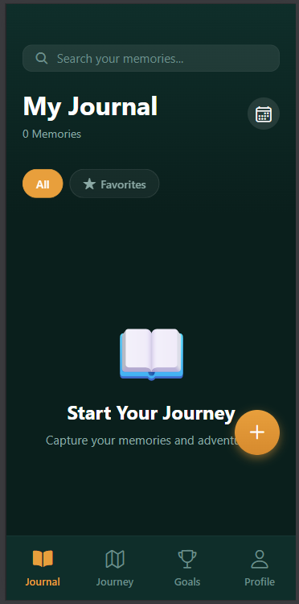
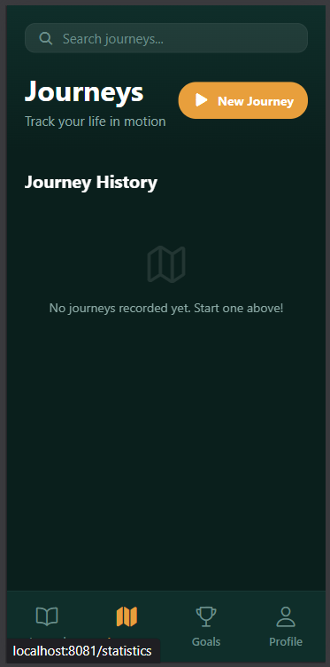

# 📖 Journal App

A premium React Native journal application for capturing memories, tracking goals, and visualizing your emotional journey with a beautiful, modern design.

---

## ✨ Features

- ✍️ **Capture**: Rich journal entries with photos, location, and weather.
- 🎯 **Goals**: Track progress, streaks, and earn achievements.
- 🎨 **Design**: Seamless light/dark modes with smooth micro-interactions.
- 🔒 **Privacy**: Secure authentication to keep your thoughts private.

---

## 🛠️ Quick Start

1. **Install**: `npm install`
2. **Configure**: Setup Firebase in `config/firebaseConfig.ts`.
3. **Run**: `npx expo start`

---

## 📷 Screenshots

  
  

---

> [!TIP]
> **Pro Tip**: Use the search bar in the header to instantly find any memory by keyword!
